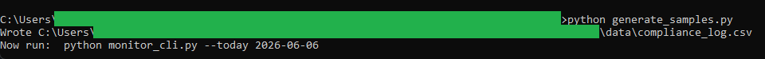
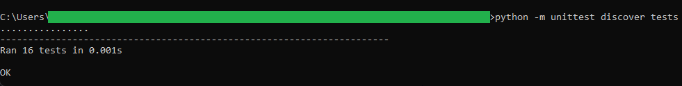
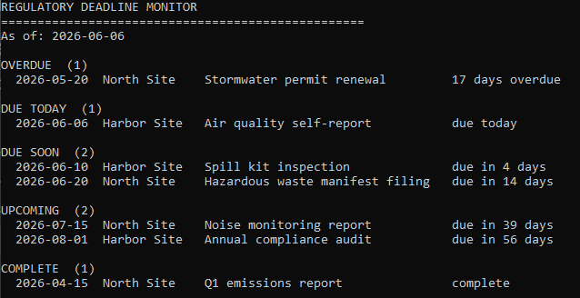
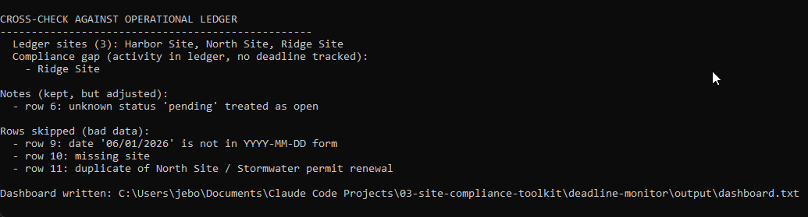
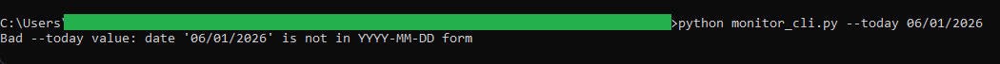

# Regulatory Deadline Monitor

A small command line tool that reads a log of environmental compliance
requirements, compares each due date to today, and prints a dashboard sorted by
urgency, so the overdue and soon-due work rises to the top where you can see it.

If you track compliance dates, you know the problem: the dates sit in a
spreadsheet, sorted by site or by whoever typed them last, and the one that is
overdue is three rows from the bottom. This tool reads the list, works out how
many days each item is from today, and groups them into plain buckets: overdue,
due today, due soon, and upcoming. It also reads the operational ledger from the
waste and fuel aggregator and points out any site that is clearly active but has
no compliance deadline on file.

```
data/compliance_log.csv      ->     OVERDUE   (1)
  site,requirement,                   2026-05-20  North Site  Stormwater permit  17 days overdue
  due_date,status                   DUE TODAY (1)
                                      2026-06-06  Harbor Site Air quality report due today
                                    DUE SOON  (2)
                                      ...
```

> This is a beginner-friendly Python micro project. It uses only the Python
> standard library, so there is nothing to install and no account to sign up
> for. All the sample data in this repo is made up. There is no real site or
> compliance data anywhere.

## What it does

- Reads a compliance log (`site`, `requirement`, `due_date`, `status`).
- Insists on dates written as `YYYY-MM-DD`, so a date is never ambiguous.
- Sorts every open item into a band by how many days away it is: `OVERDUE`,
  `DUE TODAY`, `DUE SOON` (within 14 days), or `UPCOMING`.
- Lists completed items separately so they do not clutter the live work.
- Rejects rows with a blank site, a blank requirement, or a bad date, and reports
  each one with a reason.
- Reads the aggregator's unified ledger and flags any site that has operational
  activity but no tracked deadline (a compliance gap).
- Writes a copy of the dashboard to `output/dashboard.txt`.

## Requirements

- Python 3.8 or newer. Check with `python --version`.
- Nothing else.

## Getting started

From inside this folder:

```bash
# 1. Create the sample compliance log in data/
python generate_samples.py

# 2. Print the dashboard. The fixed date makes the output match this README.
python monitor_cli.py --today 2026-06-06
```

Leave off `--today` to use the real today instead:

```bash
python monitor_cli.py
```

### About the cross-check

The cross-check needs the aggregator's ledger. If you have already run the
waste and fuel aggregator, its `output/unified_ledger.csv` is found automatically.
If you have not, the monitor still runs and simply notes that no ledger was found.
To enable the check, run the aggregator first:

```bash
cd ../waste-fuel-aggregator
python generate_samples.py
python aggregate_cli.py
cd ../deadline-monitor
python monitor_cli.py --today 2026-06-06
```

## In action

Creating the sample compliance log in `data/`:



The test suite passing:



A full run with a fixed date: every item is sorted into its urgency band, each
line showing the explicit due date and a plain day count:



The same run then cross-checks against the aggregator's ledger. It confirms the
3 ledger sites, flags Ridge Site as a compliance gap (activity but no deadline),
notes the `pending` status it treated as open, and lists the rejected rows:



Given an ambiguous slash date, the tool refuses it instead of guessing:



## Options

```bash
python monitor_cli.py --log data/compliance_log.csv --today 2026-06-06 \
  --ledger ../waste-fuel-aggregator/output/unified_ledger.csv \
  --out output/dashboard.txt
```

## How it stays trustworthy

- **Dates are unambiguous.** Only `YYYY-MM-DD` is accepted, so `06/01/2026` is
  rejected rather than guessed at.
- **Nothing is dropped silently.** Every rejected row and every adjusted status is
  printed with a reason.
- **The boundaries are explicit.** An item due in exactly 14 days is `DUE SOON`;
  one due in 15 is `UPCOMING`. The threshold is a single constant at the top of
  `core.py`.

## How it connects to the other tools

This tool reads the unified ledger written by the **Regional Waste and Fuel Log
Aggregator**. On the sample data both tools agree that the ledger holds 3 distinct
sites (Harbor Site, North Site, Ridge Site). The monitor then shows that Ridge Site
has activity but no tracked deadline. See `spec.md` for that hand-checked value.

## Project layout

```
deadline-monitor/
  README.md            This file
  spec.md              The full specification
  core.py              All the logic: parse dates, classify urgency, cross-check
  monitor_cli.py       Command line front end
  generate_samples.py  Creates the sample compliance log
  data/                The compliance log (sample data, read-only)
  output/              The dashboard copy lands here (created on run, git-ignored)
  tests/
    test_core.py       Tests for the date and urgency functions
```

## Running the tests

```bash
python -m unittest discover tests
```

The tests check the trickiest parts: parsing dates strictly, classifying each
urgency band including the exact 0-day and 14-day boundaries, and finding sites
with activity but no deadline.

## Ideas for extending it

- Change `DUE_SOON_DAYS` at the top of `core.py` to widen or narrow the warning
  window.
- Add an `owner` column to the log and show who is responsible for each item.
- Add a band for items due within 2 days so the most urgent ones stand out more.
