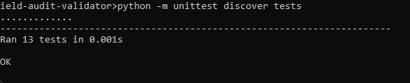
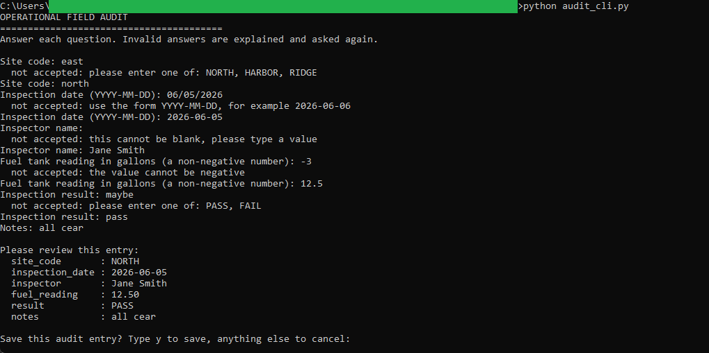
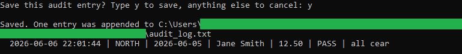
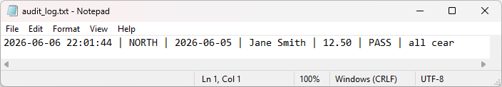

# Operational Field Audit Validator

A small interactive command line tool for site inspectors. It asks a short set of
questions, forces every answer to be the right type, and keeps asking until the
answer is valid, then records one timestamped line to a log.

If you collect field audits, you know the problem: a paper form or a free-text box
lets anyone write the date three different ways, leave the reading blank, or put
`maybe` where it should say pass or fail. By the time you notice, the entry is
already filed. This tool checks each answer as it is typed. A bad answer is
explained and asked again, so only clean, consistent entries reach the log.

```
Site code: east
  not accepted: please enter one of: NORTH, HARBOR, RIDGE
Site code: north
Inspection date (YYYY-MM-DD): 2026-06-05
...
Saved. One entry was appended to audit_log.txt
  2026-06-06 14:30:00 | NORTH | 2026-06-05 | Jane Smith | 12.50 | PASS | all clear
```

> This is a beginner-friendly Python micro project. It uses only the Python
> standard library, so there is nothing to install and no account to sign up
> for. Anything you type stays on your machine in a local text file. No sample
> data ships with this tool, since you create the entries yourself.

## What it does

- Asks each question in `questions.py` in order.
- Validates every answer by type: a choice from a list, a `YYYY-MM-DD` date, a
  non-negative number, or non-empty text.
- Explains any invalid answer and asks the same question again, looping until the
  answer is valid. It never crashes on a typo.
- Shows a summary and asks for confirmation before saving.
- Appends one timestamped, pipe-delimited line per confirmed audit to
  `audit_log.txt`.

## Requirements

- Python 3.8 or newer. Check with `python --version`.
- Nothing else.

## Getting started

From inside this folder:

```bash
python audit_cli.py
```

Answer each question. To see the validation in action, type a wrong answer on
purpose (for example `east` for the site code, or `06/05/2026` for the date) and
watch the tool explain it and ask again. At the end, type `y` to save.

The entry is appended to `audit_log.txt` in this folder. Run the tool again to add
another line. To save somewhere else:

```bash
python audit_cli.py --log "C:\path\to\audits.txt"
```

## In action

The test suite passing:



A run where a wrong answer is typed at each question. The tool refuses each one
with a reason and asks again, then shows the entry for review once every answer is
valid:



Confirming the entry appends one timestamped line to the log:



The saved entry in `audit_log.txt`, one clean pipe-delimited line:



## The questions

The questionnaire is defined in `questions.py`, which is the one place to edit it.
Each question is a small dictionary with a key, a prompt, a type, and (for a
choice) the allowed answers. Add, remove, or reorder them there and both the
prompts and the saved columns follow.

## How it stays trustworthy

- **Bad answers never reach the log.** Validation happens before anything is
  saved, and the loop repeats until the answer is valid.
- **Dates are unambiguous.** Only `YYYY-MM-DD` is accepted.
- **Numbers are exact.** A reading is stored as fixed-point with two decimals.
- **The columns stay intact.** A stray pipe or line break typed into a text answer
  is replaced with a space, so one audit is always one clean line.
- **You confirm before saving.** Anything other than yes cancels without writing.

## Project layout

```
field-audit-validator/
  README.md        This file
  spec.md          The full specification
  core.py          The validators and the line formatter (pure, tested)
  questions.py     The questionnaire definition (edit this to change questions)
  audit_cli.py     The interactive front end
  audit_log.txt    Created the first time you save (git-ignored)
  tests/
    test_core.py   Tests for each validator and the line formatter
```

`core.py` holds the rules and `audit_cli.py` does the talking. Keeping the rules
separate is what lets the tests check each validator without anyone typing at a
keyboard.

## Running the tests

```bash
python -m unittest discover tests
```

The tests check each validator with a good value and a bad value, and check that a
finished entry becomes one clean, timestamped line (with the timestamp passed in,
so the test does not depend on the clock).

## Ideas for extending it

- Add a question to `questions.py`, for example a second choice for weather or a
  text field for the crew lead.
- Add a `number` question for a second reading and watch it use the same rule.
- Change a choice list, for example adding a `NEEDS REVIEW` result alongside
  `PASS` and `FAIL`.
