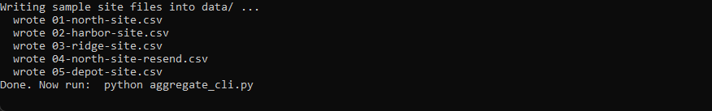
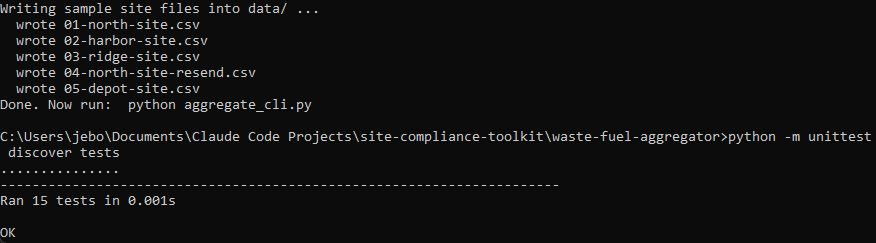
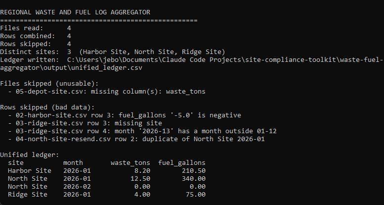
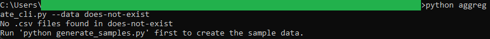

# Regional Waste and Fuel Log Aggregator

A small command line tool that reads a folder of monthly site spreadsheets,
where every site names its columns differently, and combines them into one clean
operational ledger of waste tonnage and fuel use.

If you consolidate field data, you know the problem: every site sends a
spreadsheet, but one writes `Waste (tons)`, another writes `Waste Tonnage`, and a
third writes `waste_tons`. Before you can total anything you have to line the
columns up by hand, and quietly drop the rows that are blank, negative, or
mislabeled. This tool does that line-up for you, rejects the bad rows with a
reason for each, and writes a single ledger you can trust.

```
data/                          output/
  01-north-site.csv              unified_ledger.csv
  02-harbor-site.csv    ->       site,month,waste_tons,fuel_gallons
  03-ridge-site.csv              Harbor Site,2026-01,8.20,210.50
  ...                            North Site,2026-01,12.50,340.00
                                 ...
```

> This is a beginner-friendly Python micro project. It uses only the Python
> standard library, so there is nothing to install and no account to sign up
> for. All the sample data in this repo is made up. There is no real site or
> operational data anywhere.

## What it does

- Reads every `.csv` in a folder (default `data/`), one file per site per month.
- Translates each file's column names into one shared set: `site`, `month`,
  `waste_tons`, `fuel_gallons`. Matching ignores case and extra spaces.
- Validates every row and skips the bad ones with a clear reason (blank site,
  bad month, non-numeric or negative quantity).
- Skips a whole file if it is missing a required column, and names the column.
- Removes duplicates: if a site sends the same month twice, the first is kept and
  the resend is reported.
- Writes `output/unified_ledger.csv`, sorted by site then month, with quantities
  as fixed-point numbers (for example `12.50`).
- Prints a summary of what was combined and what was dropped.

## Requirements

- Python 3.8 or newer. Check with `python --version`.
- Nothing else.

## Getting started

From inside this folder:

```bash
# 1. Create the sample site files in data/
python generate_samples.py

# 2. Combine them into one ledger and print the summary
python aggregate_cli.py
```

The ledger is written to `output/unified_ledger.csv`. Your input files in `data/`
are only read, never changed, so you can run it as often as you like.

## Options

```bash
# Point at your own folder of site files and your own output path
python aggregate_cli.py --data "C:\path\to\monthly-files" --out "C:\path\to\ledger.csv"
```

## In action

Creating the sample site files in `data/`:



The test suite passing:



A full run: the report shows the files read, the rows combined, the 3 distinct
sites, and the clean ledger at the bottom. The same run also lists every file and
row it refused, with a reason for each: the negative fuel value, the blank site,
the bad month `2026-13`, the duplicate resend, and the file missing a column.



Pointed at a folder that does not exist, the tool prints a calm instruction
instead of a stack trace:



## Example

A clean file (`01-north-site.csv`):

```csv
Site,Month,Waste (tons),Fuel (gal)
North Site,2026-01,12.5,340.0
North Site,2026-02,0.00,0.00
```

A file from another site using different names (`02-harbor-site.csv`):

```csv
Location,Reporting Month,Waste Tonnage,Diesel Gallons
Harbor Site,2026-01,8.2,210.5
Harbor Site,2026-02,9.1,-5.0
```

combine into:

```csv
site,month,waste_tons,fuel_gallons
Harbor Site,2026-01,8.20,210.50
North Site,2026-01,12.50,340.00
North Site,2026-02,0.00,0.00
Ridge Site,2026-01,4.00,75.00
```

The Harbor Site February row is left out because its fuel value is negative, and
the tool reports exactly why.

## How it stays trustworthy

- **Nothing is dropped silently.** Every skipped file and row is printed with a
  reason, so the ledger and the report together account for every input line.
- **Quantities are exact.** Values are handled with `decimal.Decimal` and printed
  as fixed-point, so totals never drift and never show as scientific notation.
- **Inputs are read-only.** Everything is written into `output/`, leaving your
  `data/` files untouched.

## How it connects to the other tools

The ledger this tool writes is the input the **Regulatory Deadline Monitor** reads
to cross-check that every site with operational activity also has a tracked
compliance deadline. On the sample data both tools agree that there are 3 distinct
sites (Harbor Site, North Site, Ridge Site). See `spec.md` for that hand-checked
value.

## Project layout

```
waste-fuel-aggregator/
  README.md            This file
  spec.md              The full specification
  core.py              All the logic: normalise, validate, combine, write
  aggregate_cli.py     Command line front end
  generate_samples.py  Creates the sample site files
  data/                The monthly site files (sample data, read-only)
  output/              The unified ledger lands here (created on run, git-ignored)
  tests/
    test_core.py       Tests for the normalising and validating functions
```

`core.py` holds the real work and the front end calls into it. Keeping the logic
in one place is a common and useful pattern: the same functions can be tested on
their own and reused by any front end.

## Running the tests

```bash
python -m unittest discover tests
```

The tests check the trickiest parts: translating different column names,
rejecting bad quantities and months, and formatting quantities cleanly.

## Ideas for extending it

- Add another column spelling to `HEADER_SYNONYMS` at the top of `core.py` when a
  new site shows up with a name the tool does not recognise yet.
- Add a `total` row per site to the printed summary.
- Support a fifth quantity column (for example water use) by adding it to
  `CANONICAL_COLUMNS` and `HEADER_SYNONYMS`.
